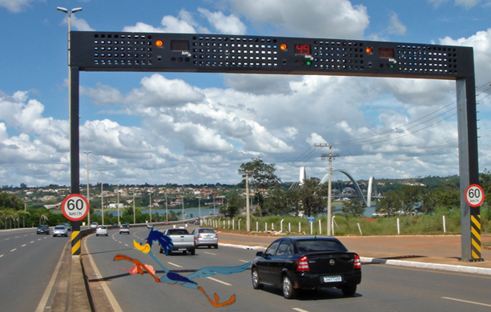
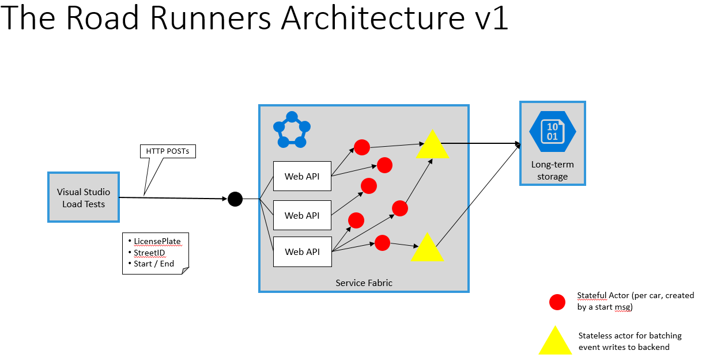
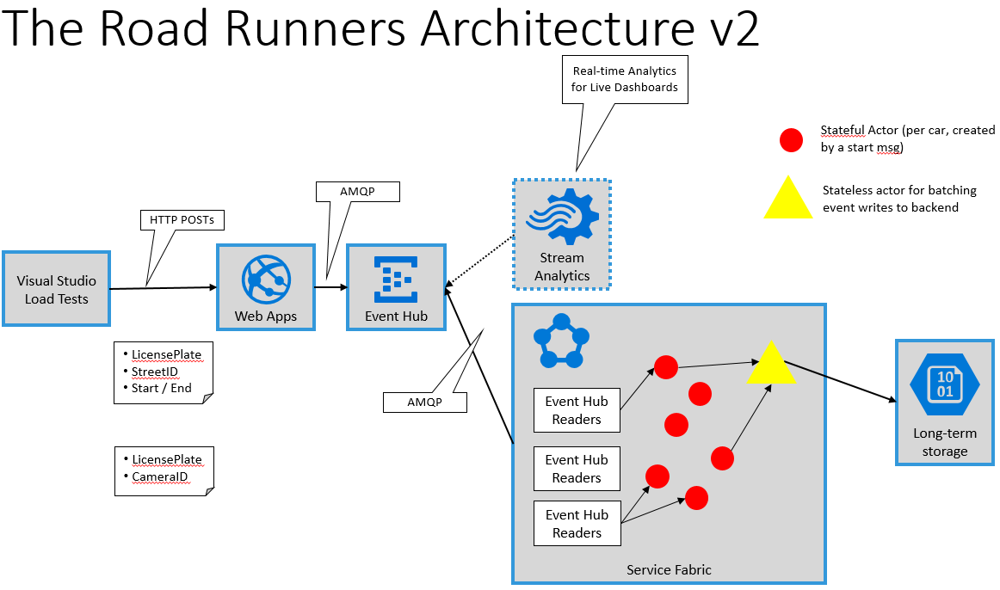

# ServiceFabric Hackathon

 

## Team 

- Clemens Schotte
- Martin Weber
- Sander van den Hoven
- Christian Geuer-Pollmann

## Architecture v1

 

## Scenario

Traffic speed in the Netherlands is measured by two cameras with license plate detection, placed a few kilometers from each other. By measuring at which point in time a car enters an area and leaves it minutes later, the system is able to calculate average speed, and determine traffic rule violations. 

- A VisualStudio-based load test agent simulates events of cars entering and leaving a measurement area. 
- These events fly in as HTTP POSTs, are augmented with server-side time stamps, and stored in Azure EventHub (round-robin preferrably). 
- A Service Fabric cluster runs consumers to get messages out of EventHub. 
- For each `entering` event, a stateful actor is created. 
- When the `leaving` event occurs, the stateful actor computes the average speed, and sends a message to a stateless DB-writer-actor.
- The DB-writer-actor batches DB writes for efficiency, to avoid all stateful actors making their own database connections. 

## Architecture v2

 
